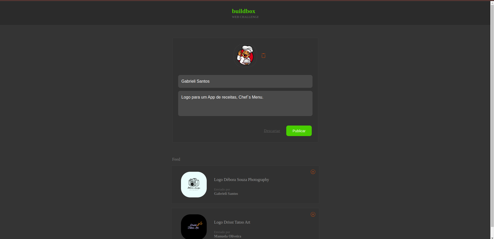
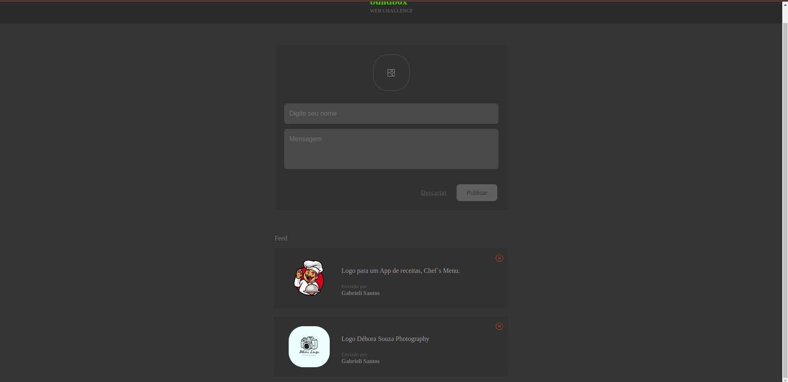
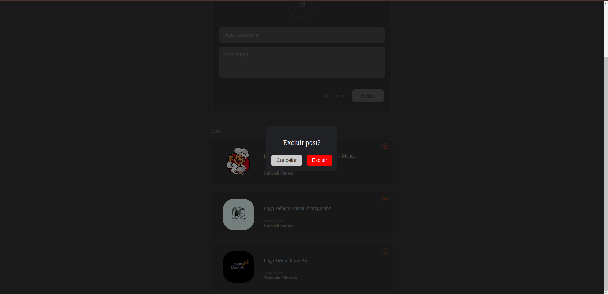

*Buildbox Challenge*
Este é um aplicativo simples desenvolvido em React.js que permite aos usuários visualizar uma lista de posts, adicionar novos posts e remover posts existentes. Os dados são manipulados localmente no Front-End, sem a necessidade de um Back-End.

*Demonstração*

*Funcionalidades*
Visualização de uma lista de posts.
Adição de novos posts.
Remoção de posts existentes.

*Tecnologias Utilizadas*
React.js
TypeScript
Styled Components
