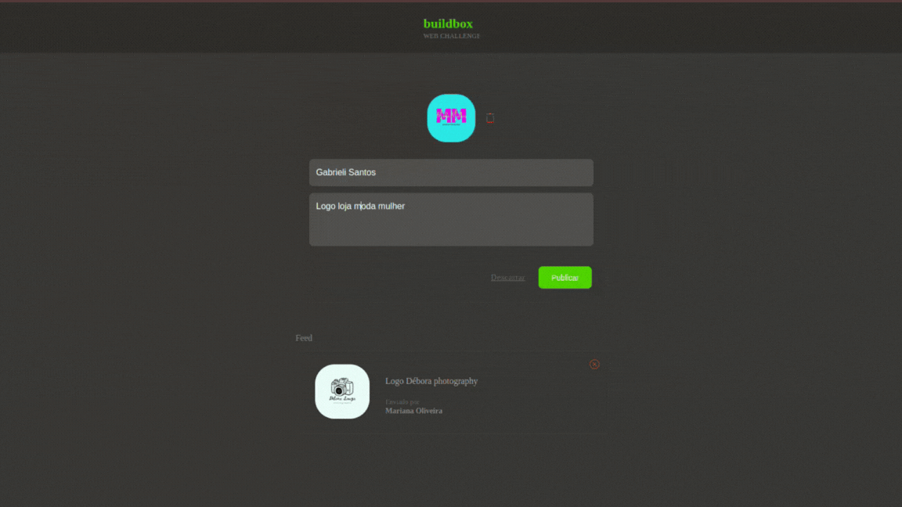

**BUILDBOX CHALLENGE**

Esta é uma aplicação simples desenvolvida em React.js que permite aos usuários visualizar uma lista de posts, adicionar novos posts e remover posts existentes. Os dados são manipulados localmente no Front-End.

*FUNCIONALIDADES*

- Visualização de uma lista de posts.
- Adição de novos posts.
- Remoção de posts existentes.

*TECNOLOGIAS UTILIZADAS*

- React.js
- TypeScript
- Styled Components
